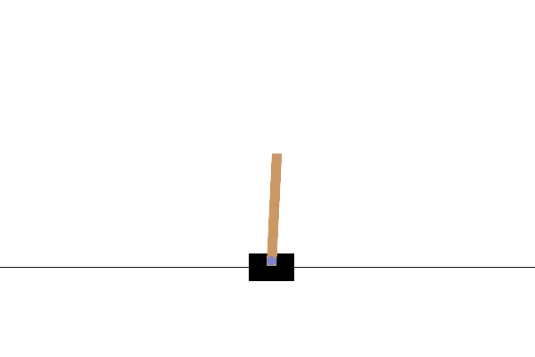

# Reinforcement Learning with Stable Baselines3
Basic RL model training examples with [Stable Baselines3](https://stable-baselines3.readthedocs.io/en/master/index.html) RL algorithm library uses pytorch.

Tested on Ubuntu 22.04 with _Python 3.12.1_.

<p align="center">
 
</p>

## Installation

Since the implementations are vectorised, a CUDA capable GPU is required. 
Clone the repository into your workspace. Then create dirs to save trained models and log files.
```
cd RL_training_sb3
mkdir -p Training/Saved_Models
mkdir -p Training/Logs
```

A [conda](https://docs.conda.io/projects/miniconda/en/latest/) environment is recommended for installing the requirements.
Import the conda environment from a .yml file (platform specific: linux-64) and create _your_env_.
```
conda env create -n your_env --file rl_env.yml
conda activate your_env
```

## Training the Model

With the environment is set correctly you should be able to run the scripts.

Train and test the cartpole model:
```
python3 cartpole.py
```

## Visualize the Training

Visualize training logs with tensorboard(on browser)
```
tensorboard --logdir={log_path}
```
